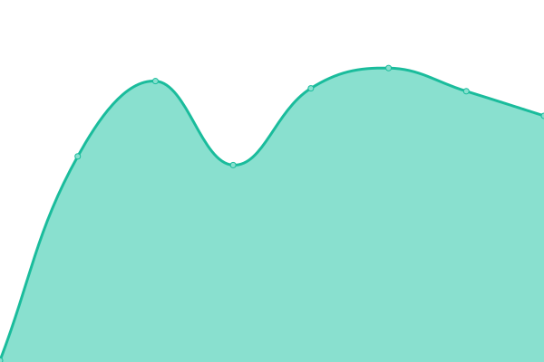

# [📈 Live Status](https://demo.upptime.js.org): <!--live status--> **🟧 Partial outage**

This repository contains the open-source uptime monitor and status page for [Upptime](https://upptime.js.org), powered by [Upptime](https://github.com/upptime/upptime).

With [Upptime](https://upptime.js.org), you can get your own unlimited and free uptime monitor and status page, powered entirely by a GitHub repository. We use [Issues](https://github.com/upptime/upptime/issues) as incident reports, [Actions](https://github.com/monitorapp-aicc/ailabs-status/actions) as uptime monitors, and [Pages](https://demo.upptime.js.org) for the status page.

<!--start: status pages-->
<!-- This summary is generated by Upptime (https://github.com/upptime/upptime) -->
<!-- Do not edit this manually, your changes will be overwritten -->
<!-- prettier-ignore -->
| URL | Status | History | Response Time | Uptime |
| --- | ------ | ------- | ------------- | ------ |
|  [File analysis](https://ailabs-api.monitorapp.com/v1/analysis/file) | 🟩 Up | [file-analysis.yml](https://github.com/monitorapp-aicc/ailabs-status/commits/HEAD/history/file-analysis.yml) | 

 810ms
     
 | 

<a href="https://monitorapp-aicc.github.io/ailabs-status/history/file-analysis">100.00%</a>
    

|  [Inquiring file status](https://ailabs-api.monitorapp.com/v1/analysis/file/status?id=100) | 🟩 Up | [inquiring-file-status.yml](https://github.com/monitorapp-aicc/ailabs-status/commits/HEAD/history/inquiring-file-status.yml) | 

 774ms
     
 | 

<a href="https://monitorapp-aicc.github.io/ailabs-status/history/inquiring-file-status">100.00%</a>
    

|  [Inquiring file result](https://ailabs-api.monitorapp.com/v1/analysis/file/result?id=100) | 🟩 Up | [inquiring-file-result.yml](https://github.com/monitorapp-aicc/ailabs-status/commits/HEAD/history/inquiring-file-result.yml) | 

 791ms
     
 | 

<a href="https://monitorapp-aicc.github.io/ailabs-status/history/inquiring-file-result">100.00%</a>
    

|  [URL analysis](https://ailabs-api.monitorapp.com/v1/analysis/url) | 🟩 Up | [url-analysis.yml](https://github.com/monitorapp-aicc/ailabs-status/commits/HEAD/history/url-analysis.yml) | 

 771ms
     
 | 

<a href="https://monitorapp-aicc.github.io/ailabs-status/history/url-analysis">100.00%</a>
    

|  [Bulk URL analysis](https://ailabs-api.monitorapp.com/v1/analysis/url/bulk) | 🟥 Down | [bulk-url-analysis.yml](https://github.com/monitorapp-aicc/ailabs-status/commits/HEAD/history/bulk-url-analysis.yml) | 

 703ms
     
 | 

<a href="https://monitorapp-aicc.github.io/ailabs-status/history/bulk-url-analysis">0.00%</a>
    

|  [Bulk URL analysis results list query by task ID](https://ailabs-api.monitorapp.com/v1/analysis/url/bulk/task_list) | 🟥 Down | [bulk-url-analysis-results-list-query-by-task-id.yml](https://github.com/monitorapp-aicc/ailabs-status/commits/HEAD/history/bulk-url-analysis-results-list-query-by-task-id.yml) | 

 707ms
     
 | 

<a href="https://monitorapp-aicc.github.io/ailabs-status/history/bulk-url-analysis-results-list-query-by-task-id">0.00%</a>
    

|  [Inquiring URL result](https://ailabs-api.monitorapp.com/v1/analysis/url/result?id=50341510-4e57-4b99-a398-97c43a79d9c5) | 🟥 Down | [inquiring-url-result.yml](https://github.com/monitorapp-aicc/ailabs-status/commits/HEAD/history/inquiring-url-result.yml) | 

 803ms
     
 | 

<a href="https://monitorapp-aicc.github.io/ailabs-status/history/inquiring-url-result">0.00%</a>
    

|  [Malicious URL match](https://ailabs-api.monitorapp.com/v1/search/url/malicious) | 🟩 Up | [malicious-url-match.yml](https://github.com/monitorapp-aicc/ailabs-status/commits/HEAD/history/malicious-url-match.yml) | 

 788ms
     
 | 

<a href="https://monitorapp-aicc.github.io/ailabs-status/history/malicious-url-match">100.00%</a>
    

|  [Inquiring URL Category](https://ailabs-api.monitorapp.com/v1/search/url/category) | 🟩 Up | [inquiring-url-category.yml](https://github.com/monitorapp-aicc/ailabs-status/commits/HEAD/history/inquiring-url-category.yml) | 

 758ms
     
 | 

<a href="https://monitorapp-aicc.github.io/ailabs-status/history/inquiring-url-category">100.00%</a>
    

|  [Web attacker ip match request](https://ailabs-api.monitorapp.com/v1/search/ip/attacker) | 🟩 Up | [web-attacker-ip-match-request.yml](https://github.com/monitorapp-aicc/ailabs-status/commits/HEAD/history/web-attacker-ip-match-request.yml) | 

 1316ms
     
 | 

<a href="https://monitorapp-aicc.github.io/ailabs-status/history/web-attacker-ip-match-request">100.00%</a>
    

|  [Malicious file match request](https://ailabs-api.monitorapp.com/v1/search/file/malicious) | 🟩 Up | [malicious-file-match-request.yml](https://github.com/monitorapp-aicc/ailabs-status/commits/HEAD/history/malicious-file-match-request.yml) | 

 728ms
     
 | 

<a href="https://monitorapp-aicc.github.io/ailabs-status/history/malicious-file-match-request">100.00%</a>
    

|  [Search bot category](https://ailabs-api.monitorapp.com/v1/search/bot/category) | 🟩 Up | [search-bot-category.yml](https://github.com/monitorapp-aicc/ailabs-status/commits/HEAD/history/search-bot-category.yml) | 

 813ms
     
 | 

<a href="https://monitorapp-aicc.github.io/ailabs-status/history/search-bot-category">100.00%</a>
    

|  [Search bot match](https://ailabs-api.monitorapp.com/v1/search/bot/match) | 🟩 Up | [search-bot-match.yml](https://github.com/monitorapp-aicc/ailabs-status/commits/HEAD/history/search-bot-match.yml) | 

 744ms
     
 | 

<a href="https://monitorapp-aicc.github.io/ailabs-status/history/search-bot-match">100.00%</a>
    

|  [Search IP reputation](https://ailabs-api.monitorapp.com/v1/search/ip_reputation?ip=10.0.0.1&start=2025-05-01&end=2025-05-02) | 🟩 Up | [search-ip-reputation.yml](https://github.com/monitorapp-aicc/ailabs-status/commits/HEAD/history/search-ip-reputation.yml) | 

 830ms
     
 | 

<a href="https://monitorapp-aicc.github.io/ailabs-status/history/search-ip-reputation">100.00%</a>
    

|  [Mis URL report](https://ailabs-api.monitorapp.com/v1/ailabs/url/mis_report) | 🟥 Down | [mis-url-report.yml](https://github.com/monitorapp-aicc/ailabs-status/commits/HEAD/history/mis-url-report.yml) | 

 720ms
     
 | 

<a href="https://monitorapp-aicc.github.io/ailabs-status/history/mis-url-report">0.00%</a>
    

|  [Mis IP report](https://ailabs-api.monitorapp.com/v1/ailabs/ip/mis_report) | 🟥 Down | [mis-ip-report.yml](https://github.com/monitorapp-aicc/ailabs-status/commits/HEAD/history/mis-ip-report.yml) | 

 694ms
     
 | 

<a href="https://monitorapp-aicc.github.io/ailabs-status/history/mis-ip-report">0.00%</a>
    

|  [Mis report history](https://ailabs-api.monitorapp.com/v1/ailabs/api/mis_report) | 🟥 Down | [mis-report-history.yml](https://github.com/monitorapp-aicc/ailabs-status/commits/HEAD/history/mis-report-history.yml) | 

 731ms
     
 | 

<a href="https://monitorapp-aicc.github.io/ailabs-status/history/mis-report-history">0.00%</a>
    

<!--end: status pages-->

[**Visit our status website →**](https://demo.upptime.js.org)

## 📄 License

- Powered by: [Upptime](https://github.com/upptime/upptime)
- Code: [MIT](./LICENSE) © [Anand Chowdhary](https://anandchowdhary.com), supported by [Pabio](https://pabio.com)
- Data in the `./history` directory: [Open Database License](https://opendatacommons.org/licenses/odbl/1-0/)
